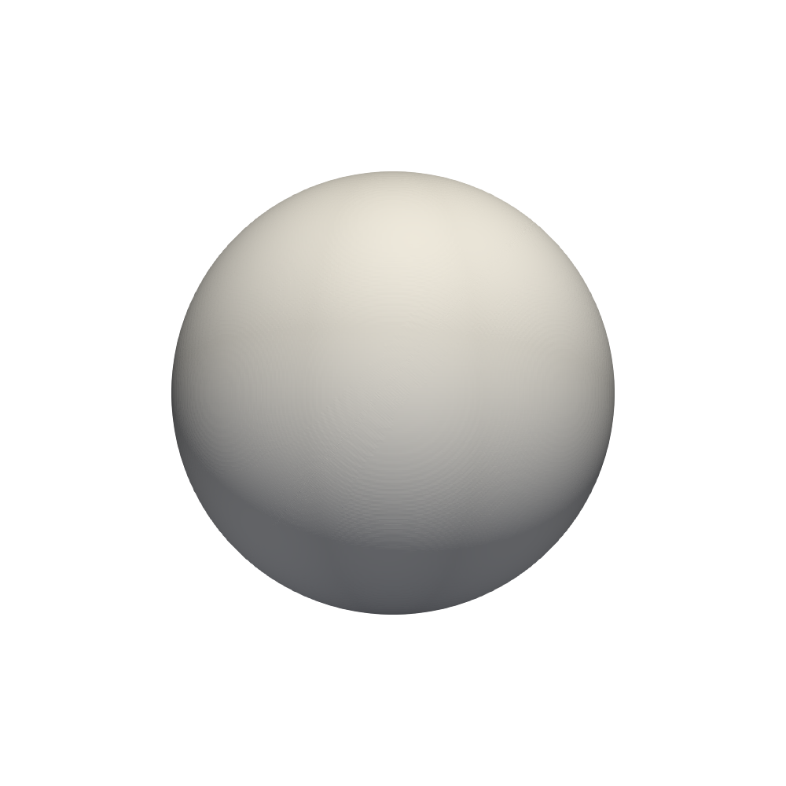
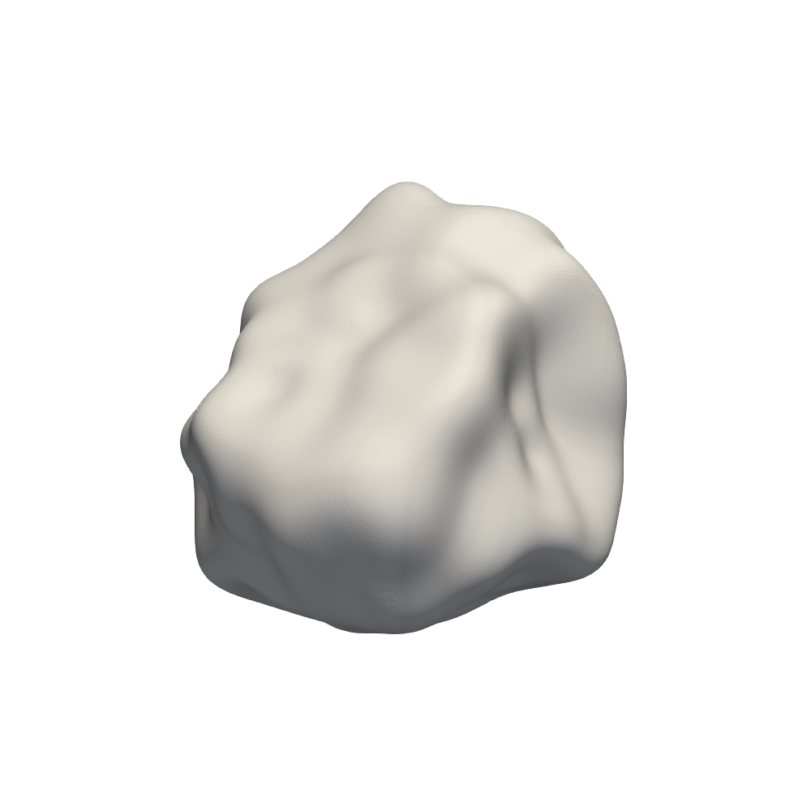
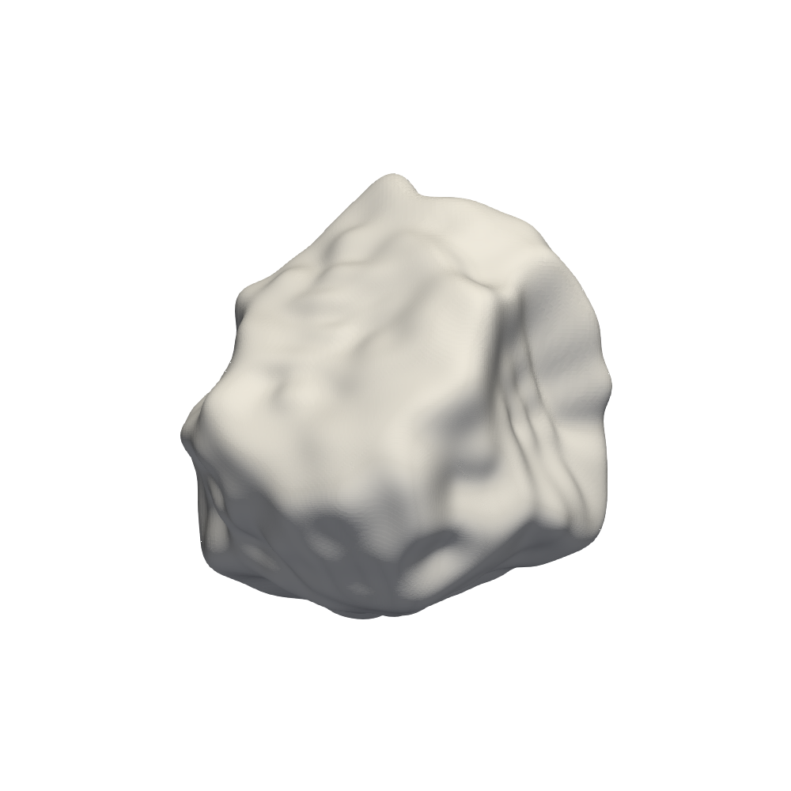

SPHERHARM Theory
================== 

Spherical harmonics can be used to represent a  closed star-like i.e., any line segment drawn from an origin, O, inside the particle crosses the  contour of the particle's only once  three-dimensional surface :cite:author:`Garboczi2002`. This is achieved using both the spherical harmonic functions :math:`Y_n^m(\theta,\phi)` and the spherical harmonic coefficients :math:`a_{nm}`:

.. math:: 

    r(\theta,\phi) = \sum_{n=0}^\infty\sum_{m=-n}^n a_{nm} Y_n^m(\theta, \phi) \approx r(N,\theta,\phi) = \sum_{n=0}^N\sum_{m=-n}^n a_{nm} Y_n^m(\theta, \phi)

where :math:`r(\theta,\phi)` is any smooth function defined on the unit sphere with :math:`0\le\theta\le\pi` and :math:`0\le\phi\le 2\pi` 
:cite:t:`atkinson_1982`.

In this case, :math:`r(\theta,\phi)` describes the particle radius which is measured from its centre of mass. In practice, the above is approximated by truncating the initial sum from infinity to :math:`\theta`. Spherical harmonic function, :math:`Y_n^m` of a degree :math:`n` and order :math:`m` is given as

.. math:: 
    Y_n^m(\theta, \phi) = \sqrt{\frac{(2n+1)(n-m)!}{4\pi(n+m)!}}P_n^m(\cos(\theta))e^{im\phi}

where :math:`P_n^m(x)` is the associated Legendre function, which can be calculated efficiently through the recurrence relations described by Press et al.\@~\cite{Press2007}.

Garboczi details how the coefficients :math:`a_{nm}` can be extracted from a real particle using X-ray tomography and selecting radius measurement points that correspond with point of Gaussian quadrature such that
can be solved, where the asterisk in the above denotes the complex conjugate  :cite:t:`zhou2015micromorphology`.

.. math::
    a_{nm} = \int_0^{2\pi}\int_0^\pi  d\phi d\theta \sin(\theta) r(\theta, \phi) Y_n^m(\theta, \phi)^*

